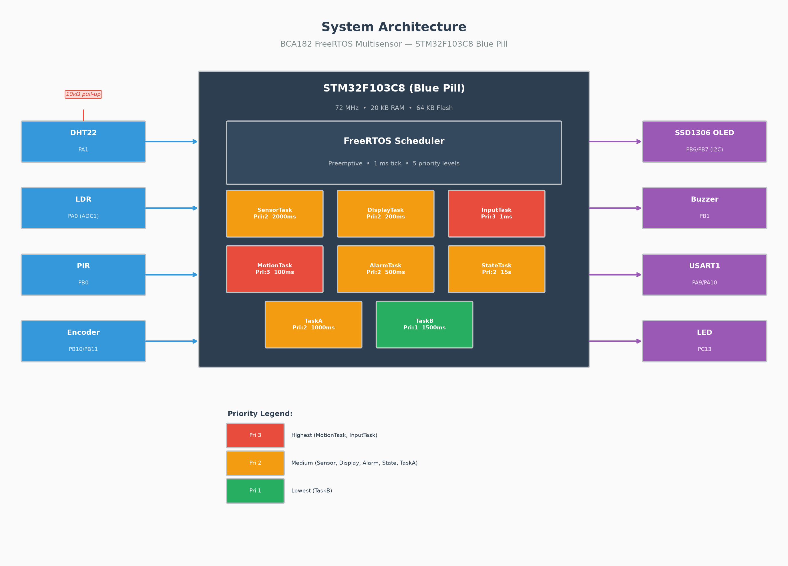
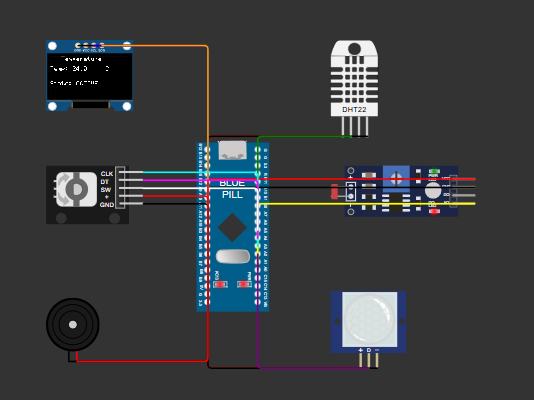

# BCA182 FreeRTOS Multisensor

STM32F103C8 (Blue Pill) multitasking multisensor system using FreeRTOS,
STM32 HAL, and PlatformIO. Reads temperature, humidity, light level, and
motion; drives an SSD1306 OLED display and buzzer alarm; navigates display
pages via a rotary encoder.

## Hardware

| Component | Wokwi Part | Purpose |
|-----------|-----------|---------|
| STM32 Blue Pill | `board-stm32-bluepill` | MCU (STM32F103C8T6, 72 MHz) |
| DHT22 | `wokwi-dht22` | Temperature and humidity |
| Photoresistor | `wokwi-photoresistor-sensor` | Ambient light (LDR) |
| PIR sensor | `wokwi-pir-motion-sensor` | Motion detection |
| Rotary encoder | `wokwi-ky-040` | Display page navigation |
| SSD1306 OLED | `wokwi-ssd1306-i2c` | 128x64 display |
| Buzzer | `wokwi-buzzer` | Temperature alarm |

## Pin Mapping

| Signal | Pin | Peripheral | Direction |
|--------|-----|-----------|-----------|
| LDR analog out | PA0 | ADC1 CH0 | Input |
| DHT22 data | PA1 | GPIO (open-drain) | Bidirectional |
| PIR output | PB0 | GPIO input (pull-down) | Input |
| Buzzer | PB1 | GPIO output (push-pull) | Output |
| OLED SCL | PB6 | I2C1 SCL | Output |
| OLED SDA | PB7 | I2C1 SDA | Bidirectional |
| Encoder CLK | PB10 | GPIO input (pull-up) | Input |
| Encoder DT | PB11 | GPIO input (pull-up) | Input |
| UART1 TX | PA9 | USART1 TX | Output |
| UART1 RX | PA10 | USART1 RX | Input |
| Onboard LED | PC13 | GPIO output (active-low) | Output |

## Documentation Visuals

### System Architecture



### Wokwi Circuit / Schematic



*The Wokwi simulation starts and prints "BCA182 FreeRTOS Multisensor" and "System starting..." to the serial monitor. The schematic shows the configured Wokwi circuit with all sensor and actuator connections. Runtime behavior of individual sensors, OLED output, and encoder interaction was not reliably verified through Wokwi simulation.*

### Laboratory Report

The full laboratory report is available at
[docs/images/laboratory-report-final.pdf](docs/images/laboratory-report-final.pdf).

## FreeRTOS Architecture

Eight application tasks using FreeRTOS preemptive multitasking with shared
sensor data distributed through a queue.

### FreeRTOS Kernel Configuration

| Parameter | Value |
|-----------|-------|
| CPU clock | 72 MHz (HSE 8 MHz x PLL9) |
| Tick rate | 1000 Hz (1 ms) |
| Preemption | Enabled |
| Time slicing | Enabled |
| Max priorities | 5 |
| Minimal stack size | 128 words |
| Total heap | 14 KB |
| Stack overflow check | Method 2 |
| Task notifications | Enabled (1 entry) |
| Mutexes | Enabled |
| Timers | Enabled (priority 2, stack 128 words) |

### Tasks

| Task | Priority | Stack | Period | Behavior |
|------|----------|-------|--------|----------|
| **SensorTask** | 2 | 256 words | 2000 ms | Reads DHT22 + LDR, sends `SensorData` to queue via `xQueueSend` (non-blocking). Uses `vTaskDelayUntil` for drift-free timing. |
| **StateTask** | 2 | 256 words | 15 s timeout | Blocks on `ulTaskNotifyTake`. Sets ACTIVE on notification, INACTIVE on timeout. |
| **MotionTask** | 3 | 256 words | 100 ms | Polls PIR pin, calls `SystemState_NotifyMotionDetected()` (`xTaskNotifyGive`). |
| **InputTask** | 3 | 256 words | 1 ms | Polls rotary encoder CLK/DT, debounces (10 ms), rotates `DisplayMode` through four pages. Encoder is gated to ACTIVE state only. |
| **DisplayTask** | 2 | 352 words | 200 ms | Peeks latest `SensorData` from queue (`xQueuePeek`, non-destructive). Renders mode header, sensor value, and ACTIVE/INACTIVE state on SSD1306 OLED. Uses `vTaskDelayUntil`. |
| **AlarmTask** | 2 | 256 words | 500 ms | Peeks `SensorData`, evaluates `EvaluateTemperature()`. Toggles buzzer at ~2 Hz when alarm is active; silences otherwise. |
| **TaskA** | 2 | 256 words | 1000 ms | Toggles onboard LED (PC13), prints diagnostic message via UART. |
| **TaskB** | 1 | 256 words | 1500 ms | Prints diagnostic message via UART. |

## Inter-Task Communication and Synchronization

### Sensor Queue

A FreeRTOS queue of depth 4 carrying `SensorData` structs. SensorTask is the
sole producer (via `xQueueSend`, non-blocking with zero tick count -- samples
are dropped when full). DisplayTask and AlarmTask are consumers; both use
`xQueuePeek` for non-destructive reads so the latest sample is always
available without consuming the item.

```c
struct SensorData {
    float temperature;   // DHT22 reading (°C)
    float humidity;      // DHT22 reading (%)
    int   lightLevel;    // LDR ADC scaled 0-100
    bool  motionDetected;// PIR state snapshot
};
```

### Mutexes

| Mutex | Created In | Protects |
|-------|-----------|----------|
| `serialMutex` | `main.cpp` | `HAL_UART_Transmit` -- prevents multi-task serial output from interleaving. |
| `displayModeMutex` | `input.cpp` | `selectedDisplayMode` -- InputTask writes, DisplayTask reads via `Input_GetDisplayMode()`. |

### Task Notification

MotionTask -> StateTask via `xTaskNotifyGive` / `ulTaskNotifyTake`.
MotionTask calls `SystemState_NotifyMotionDetected()` each time the PIR pin
reads HIGH. StateTask blocks with `ulTaskNotifyTake(pdTRUE, 15000 ms)` -- a
notification sets ACTIVE, a 15-second timeout sets INACTIVE.

### Critical Sections

`taskENTER_CRITICAL()` / `taskEXIT_CRITICAL()` protect the shared
`activityState` and `motionDetected` variables in `SystemState_GetActivityState()`,
`SystemState_IsMotionDetected()`, and the `SetState()` helper. These short
critical sections disable interrupts to ensure atomic reads and writes on
the Cortex-M3.

## ACTIVE / INACTIVE System Behavior

- **ACTIVE**: System begins in this state. Encoder navigation is enabled. Alarm
  evaluates temperature against thresholds. Motion is tracked and displayed.
- **INACTIVE**: Entered after 15 seconds without a PIR motion notification.
  Encoder navigation is disabled. Alarm is silenced regardless of temperature.
  Display shows "State: INACTIVE".
- **Transition**: Any PIR motion event immediately returns the system to ACTIVE.

## Temperature Alarm

`EvaluateTemperature()` returns `true` when:

- Temperature < **18 °C** OR temperature > **30 °C**, **AND**
- System state is **ACTIVE**

When active, the buzzer toggles at approximately 2 Hz (500 ms period). When
inactive or temperature is within range, the buzzer is held LOW (silent).

## Rotary Encoder and OLED Display Navigation

The SSD1306 OLED (128x64, I2C at address 0x3C) shows four pages, cycled by
rotating the KY-040 encoder:

| Page | Header | Value Row |
|------|--------|-----------|
| 0 | `-- Temperature --` | `Temp: XX.X C` |
| 1 | `--- Humidity  ---` | `Hum:  XX.X %` |
| 2 | `--- Light     ---` | `Light: XX /100` |
| 3 | `--- Motion    ---` | `Motion: YES/NO` |

Row 5 always shows `State: ACTIVE` or `State: INACTIVE`.

Clockwise rotation calls `NextDisplayMode()`, counter-clockwise calls
`PreviousDisplayMode()`. Navigation wraps around: MOTION -> TEMPERATURE and
TEMPERATURE -> MOTION. The encoder input is gated to the ACTIVE state -- no
page changes occur while INACTIVE.

## Project Structure

```
+-- include/
|   +-- alarm.h
|   +-- display.h
|   +-- FreeRTOSConfig.h
|   +-- input.h
|   +-- motion.h
|   +-- sensors.h
|   +-- system_state.h
+-- src/
|   +-- alarm.cpp          # AlarmTask + EvaluateTemperature()
|   +-- display.cpp         # DisplayTask + SSD1306 driver
|   +-- hal_mock.cpp        # Test-only stubs (guarded by #ifdef UNIT_TEST)
|   +-- input.cpp           # InputTask + NextDisplayMode/PreviousDisplayMode
|   +-- main.cpp            # Entry point, hardware init, task creation
|   +-- motion.cpp          # MotionTask + PIR driver
|   +-- sensors.cpp         # DHT22 bit-bang + LDR ADC read
|   +-- system_state.cpp    # StateTask + EvaluateSystemState()
+-- test/
|   +-- test_temperature/   # 5 tests for EvaluateTemperature()
|   +-- test_system_state/  # 4 tests for EvaluateSystemState()
|   +-- test_display_mode/  # 4 tests for NextDisplayMode/PreviousDisplayMode
+-- lib/
|   +-- FreeRTOS/           # FreeRTOS kernel sources (ARM_CM3 port)
+-- docs/
|   +-- images/
|       +-- laboratory-report-final.pdf
|       +-- Schematic.png
|       +-- system-architecture.png
|       +-- state-machine.png
+-- diagram.json            # Wokwi circuit diagram
+-- wokwi.toml              # Wokwi firmware paths
+-- platformio.ini          # Build configuration
+-- README.md
```

## Building the STM32 Firmware

Prerequisites: PlatformIO CLI and the `ststm32` platform package.

```bash
pio run
```

The firmware is compiled for the Blue Pill target (`bluepill_f103c8`) using
the STM32Cube framework. The clock is configured for 72 MHz (HSE 8 MHz with
PLL x9).

**Build result:** SUCCESS -- RAM 78.1% (15,988 / 20,480 bytes), Flash 28.1%
(18,428 / 65,536 bytes).

## Running the Native Unit Tests

Prerequisites: PlatformIO CLI with a native toolchain (MinGW on Windows,
GCC on Linux/macOS).

```bash
pio test -e native
```

The `native` environment compiles `alarm.cpp`, `system_state.cpp`,
`input.cpp`, and `hal_mock.cpp` for the host. FreeRTOS and HAL calls are
stubbed by `hal_mock.cpp` (compiled only when `UNIT_TEST` is defined). No
Arduino framework is used.

## Unit-Test Results

13 Unity tests across three suites, exercising production functions linked
from `src/`:

| Suite | Tests | Function Under Test |
|-------|-------|---------------------|
| `test_temperature` | 5 | `EvaluateTemperature(float, ActivityState)` -- below 18 °C, at 18 °C, in range (24 °C), at 30 °C, above 30 °C |
| `test_display_mode` | 4 | `NextDisplayMode(DisplayMode)`, `PreviousDisplayMode(DisplayMode)` -- forward navigation, backward navigation, wraparound in both directions |
| `test_system_state` | 4 | `EvaluateSystemState(bool)` -- notification->ACTIVE, timeout->INACTIVE, repeated notification, consecutive timeout |

**Result: 13/13 PASSED**

```
native         test_display_mode  PASSED    00:00:03.160
native         test_system_state  PASSED    00:00:01.944
native         test_temperature   PASSED    00:00:01.808
================= 13 test cases: 13 succeeded in 00:00:06.912 =================
```

## Static Analysis

```bash
pio check
```

Runs `cppcheck` against the `bluepill_f103c8` build.

**Result: 0 HIGH, 0 MEDIUM, 27 LOW -- PASSED**

All 27 low-severity findings are cppcheck style warnings: unused-function
reports (functions called only from `main.cpp`, which cppcheck does not
trace across translation units) and C-style pointer casts inherent to the
HAL API.

## Wokwi Setup

Open `diagram.json` in the [Wokwi](https://wokwi.com) simulator. The
`wokwi.toml` points to the PlatformIO firmware output:

| Artifact | Path |
|----------|------|
| Firmware binary | `.pio/build/bluepill_f103c8/firmware.bin` |
| ELF | `.pio/build/bluepill_f103c8/firmware.elf` |

To run:

1. Build the firmware: `pio run`
2. Open `diagram.json` in Wokwi (or use the Wokwi VS Code extension).
3. Click **Start** to simulate.

Wokwi simulates the STM32 Blue Pill, DHT22, LDR, PIR sensor, KY-040
rotary encoder, SSD1306 OLED, and buzzer using the pin connections defined
in `diagram.json`.

## Limitations

- **LDR relative light level:** The photoresistor (LDR) reports a relative
  0–100 scale derived from the 12-bit ADC value; it is not calibrated to
  absolute lux.
- **Functional test coverage:** Not every FT-01 to FT-10 functional test has
  been individually verified through runtime evidence. Some tests are
  confirmed through code review and static analysis only.
- **DHT22 verification:** DHT22 temperature and humidity readings were not
  fully individually verified in the presented runtime evidence. Correctness
  is inferred from code review, unit tests of downstream logic, and static
  analysis.
- **Wokwi DHT22 simulation behaviour:** In the current Wokwi setup, when the
  DHT22 temperature value is changed in the simulation, the simulation must
  be restarted for the changed temperature setting to be reflected correctly.
- **Physical hardware differences:** Physical hardware behaviour may differ
  from the Wokwi simulation because of wiring differences, electrical
  characteristics, timing variations, and sensor tolerances.
- **Serial output:** Serial output is not reliably observable in Wokwi due to
  simulation timing constraints. Runtime correctness of UART diagnostic
  messages was not verified through Wokwi.
- **OLED and actuator output:** OLED display output and other visual outputs
  (buzzer sound, LED blink patterns) were not reliably verifiable in Wokwi
  simulation. Functional correctness is based on code review and static
  analysis.
- **Native unit test mocks:** Native unit tests use small HAL and FreeRTOS
  mocks (`stm32f1xx_hal.h` and `FreeRTOS.h` at the project root) that stub
  all hardware access. The mocks compile to empty on STM32 builds via
  `#ifdef UNIT_TEST` guards.

## Fault Experiments

Three controlled fault experiments were performed to demonstrate the importance
of FreeRTOS scheduling and synchronization primitives. Each experiment
temporarily introduced a single fault, observed the theoretical effect, then
restored the original code.

### Experiment 1: Remove Blocking Delay

- **Target:** TaskA (`src/main.cpp`)
- **Fault:** `vTaskDelay(pdMS_TO_TICKS(1000))` temporarily commented out
- **Expected theoretical effect:** TaskA enters a tight loop without yielding,
  monopolizing CPU time and starving lower-priority TaskB (priority 1).
  Same-priority tasks experience degraded timing due to timeslice competition.
  The onboard LED (PC13) would toggle at maximum speed instead of once per second.
- **Observed effect:** Runtime behavior could not be reliably observed in Wokwi.
  Theoretical analysis confirms CPU monopolization and task starvation.
- **Restoration:** Original delay restored. No permanent changes.

### Experiment 2: Excessively High Task Priority

- **Target:** TaskB (`src/main.cpp`)
- **Fault:** Priority temporarily changed from 1 to 5 (`configMAX_PRIORITIES - 1`)
- **Expected theoretical effect:** TaskB preempts all other tasks, including
  safety-critical MotionTask (priority 3). A diagnostic print task gains higher
  priority than motion detection, inverting the intended priority design.
  System timing is disrupted whenever TaskB wakes.
- **Observed effect:** Runtime behavior could not be reliably observed in Wokwi.
  Theoretical analysis confirms priority inversion and timing degradation.
- **Restoration:** Original priority (1) restored. No permanent changes.

### Experiment 3: Remove Serial Mutex

- **Target:** `serialMutex` in `Serial_Print()` (`src/main.cpp`)
- **Fault:** `xSemaphoreTake()` and `xSemaphoreGive()` temporarily bypassed
- **Expected theoretical effect:** Multiple tasks call `HAL_UART_Transmit()`
  concurrently, causing interleaved or corrupted serial output. Message order
  becomes nondeterministic depending on scheduling decisions.
- **Observed effect:** Runtime behavior could not be reliably observed in Wokwi.
  Theoretical analysis confirms output corruption and nondeterminism.
- **Restoration:** Original mutex protection restored. No permanent changes.
