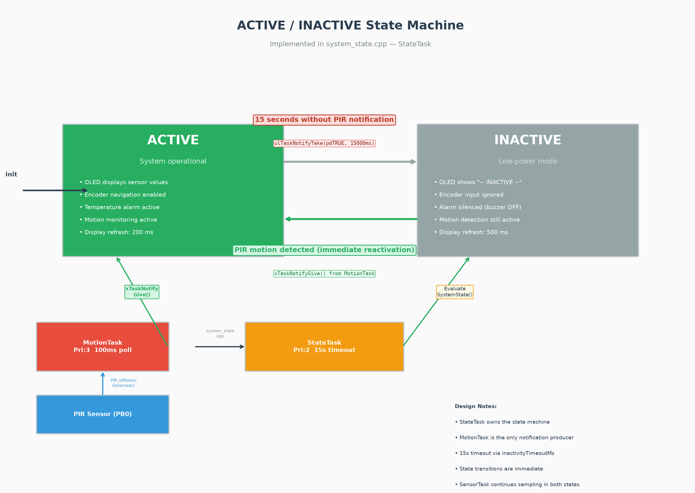

# Real-Time Multisensor Room Monitoring System

**BCA182 Embedded Systems Programming — Laboratory Activity 1**

STM32F103C8 (Blue Pill) multitasking multisensor room monitoring system using
FreeRTOS, STM32 HAL, and PlatformIO. Reads temperature, humidity, light level,
and motion; drives an SSD1306 OLED display and buzzer alarm; navigates display
pages via a rotary encoder.

---

## 1. Project Overview

This project implements a real-time multisensor room monitoring system on the
STM32F103C8 Blue Pill microcontroller. Eight FreeRTOS tasks concurrently sample
sensors, manage an ACTIVE/INACTIVE state machine, render sensor data on an
OLED display, evaluate temperature alarms, and provide UART diagnostics.

The system demonstrates core embedded systems concepts: real-time scheduling,
inter-task communication via queues and task notifications, mutual exclusion
with mutexes, periodic sampling with `vTaskDelayUntil()`, hardware peripheral
integration (ADC, I2C, UART, GPIO, Timer PWM), and a cooperative state
machine for power-aware behavior.

---

## 2. Features

- **Multi-sensor acquisition** — DHT22 (temperature/humidity), LDR (ambient
  light via ADC), and PIR (motion detection) running concurrently.
- **SSD1306 OLED display** — Four navigable pages (Temperature, Humidity,
  Light, Motion) rendered over I2C.
- **Rotary encoder navigation** — KY-040 encoder cycles through display
  pages; clockwise for next, counter-clockwise for previous.
- **Temperature alarm** — Buzzer activates via TIM1 PWM when temperature
  falls below 18 °C or exceeds 30 °C in ACTIVE state.
- **ACTIVE/INACTIVE state machine** — PIR motion triggers ACTIVE; 15-second
  timeout transitions to INACTIVE.
- **Eight FreeRTOS tasks** — SensorTask, DisplayTask, InputTask, MotionTask,
  AlarmTask, StateTask, TaskA, TaskB.
- **Inter-task communication** — Sensor data queue (depth 4, `SensorData`
  struct), two mutexes (serial, display mode), and task notification
  (MotionTask → StateTask).
- **Periodic timing** — SensorTask and DisplayTask use `vTaskDelayUntil()`
  for drift-free periodic execution.
- **UART diagnostics** — Serial output at 115200 baud for task status and
  sensor readings, protected by a mutex.
- **Unit tests** — 13 native Unity tests covering temperature evaluation,
  system state logic, and display mode navigation.
- **Static analysis** — cppcheck integration via PlatformIO.
- **Wokwi simulation** — Full circuit diagram for browser-based simulation.

---

## 3. Learning Objectives

- Apply FreeRTOS preemptive multitasking on an ARM Cortex-M3 microcontroller.
- Design inter-task communication using queues, mutexes, and task
  notifications.
- Implement periodic task scheduling with `vTaskDelayUntil()`.
- Integrate multiple hardware peripherals: ADC, I2C, UART, GPIO, and Timer
  PWM.
- Build an ACTIVE/INACTIVE state machine driven by real-time events.
- Use native unit testing with mock HAL and FreeRTOS stubs.
- Document an embedded systems project with architecture diagrams, pin
  mappings, and functional verification.

---

## 4. System Architecture


The STM32F103C8 Blue Pill runs FreeRTOS with eight application tasks. Sensors
are read periodically by SensorTask; the latest sample is shared with
DisplayTask and AlarmTask through a FreeRTOS queue. MotionTask monitors the
PIR sensor and notifies StateTask through a task notification. StateTask owns
the ACTIVE/INACTIVE state machine. InputTask polls the rotary encoder for
display page navigation.

---

## 5. FreeRTOS Architecture

### 5.1 Kernel Configuration

| Parameter | Value |
|-----------|-------|
| CPU clock | 8 MHz (HSI, reset default) |
| Tick rate | 1000 Hz (1 ms) |
| Preemption | Enabled |
| Time slicing | Enabled |
| Max priorities | 5 |
| Minimal stack size | 128 words |
| Total heap | 14 KB |
| Stack overflow check | Method 2 (`configCHECK_FOR_STACK_OVERFLOW = 2`) |
| Task notifications | Enabled (1 entry per task) |
| Mutexes | Enabled |

### 5.2 Task Table

| Task | Priority | Stack (words) | Period | Scheduling |
|------|----------|---------------|--------|------------|
| **SensorTask** | 2 | 256 | 2000 ms | `vTaskDelayUntil()` |
| **DisplayTask** | 2 | 352 | 200 ms | `vTaskDelayUntil()` |
| **AlarmTask** | 2 | 256 | 500 ms | `vTaskDelay()` |
| **StateTask** | 2 | 256 | 15 s timeout | `ulTaskNotifyTake()` blocking |
| **InputTask** | 3 | 256 | 1 ms | `vTaskDelay()` polling |
| **MotionTask** | 3 | 256 | 100 ms | `vTaskDelay()` polling |
| **TaskA** | 2 | 256 | 1000 ms | `vTaskDelay()` |
| **TaskB** | 1 | 256 | 1500 ms | `vTaskDelay()` |

Priority 3 tasks (MotionTask, InputTask) have the highest scheduling
urgency. Priority 2 tasks form the main processing group. TaskB at priority 1
is the lowest-priority task.

### 5.3 Task Descriptions

- **SensorTask** — Reads DHT22 (temperature, humidity) and LDR (light level)
  every 2 seconds using `vTaskDelayUntil()` for drift-free timing. Publishes
  a `SensorData` struct to the sensor queue via `xQueueSend()` (non-blocking;
  samples are dropped when the queue is full).

- **DisplayTask** — Peeks the latest `SensorData` from the queue via
  `xQueuePeek()` (non-destructive read) and renders the current display page
  on the SSD1306 OLED. Uses `vTaskDelayUntil()` for consistent 200 ms refresh
  rate. Shows "INACTIVE" screen when the system is inactive.

- **AlarmTask** — Peeks `SensorData` and evaluates `EvaluateTemperature()`.
  Activates the buzzer via TIM1 PWM when temperature is outside the 18–30 °C
  range and the system is ACTIVE. Silences the buzzer otherwise. Runs at 500 ms
  intervals.

- **StateTask** — Owns the ACTIVE/INACTIVE state machine. Blocks on
  `ulTaskNotifyTake(pdTRUE, 15000)`. A task notification from MotionTask sets
  the system to ACTIVE; a 15-second timeout sets it to INACTIVE. Prints state
  transitions to UART.

- **InputTask** — Polls the rotary encoder CLK and DT pins at 1 ms intervals.
  Detects falling edges on CLK with 10 ms debounce. Rotates `DisplayMode`
  through four pages (Temperature → Humidity → Light → Motion) via
  `NextDisplayMode()` / `PreviousDisplayMode()`. Encoder input is gated to the
  ACTIVE state only.

- **MotionTask** — Polls the PIR sensor output at 100 ms intervals. When
  motion is detected, calls `SystemState_NotifyMotionDetected()` which sends a
  task notification to StateTask via `xTaskNotifyGive()`.

- **TaskA** — Toggles the onboard LED (PC13) and prints a diagnostic message
  to UART every 1000 ms.

- **TaskB** — Prints a diagnostic message to UART every 1500 ms.

---

## 6. Hardware / Simulated Components

| Component | Wokwi Part | Purpose |
|-----------|-----------|---------|
| STM32 Blue Pill | `board-stm32-bluepill` | MCU (STM32F103C8T6) |
| DHT22 | `wokwi-dht22` | Temperature and humidity sensor |
| Photoresistor (LDR) | `wokwi-photoresistor-sensor` | Ambient light level (analog) |
| PIR sensor | `wokwi-pir-motion-sensor` | Motion detection (digital) |
| Rotary encoder | `wokwi-ky-040` | Display page navigation |
| SSD1306 OLED | `board-ssd1306` | 128×64 I2C display |
| Buzzer | `wokwi-buzzer` | Temperature alarm output |

---

## 7. Pin Configuration

| Signal | Pin | Peripheral | Direction |
|--------|-----|-----------|-----------|
| DHT22 data | PA0 | GPIO (open-drain, DWT timing) | Bidirectional |
| LDR analog out | PA1 | ADC1 CH1 | Input |
| PIR output | PA2 | GPIO input (no pull) | Input |
| Encoder CLK | PA3 | GPIO input (pull-up) | Input |
| Encoder DT | PA4 | GPIO input (pull-up) | Input |
| Buzzer | PA8 | TIM1 CH1 (PWM) | Output |
| UART1 TX | PA9 | USART1 TX | Output |
| UART1 RX | PA10 | USART1 RX | Input |
| OLED SCL | PB6 | I2C1 SCL | Output |
| OLED SDA | PB7 | I2C1 SDA | Bidirectional |
| Onboard LED | PC13 | GPIO output (active-low) | Output |

### Wokwi Circuit


---

## 8. Task Design

The eight tasks are designed with clear separation of concerns:

```
                    ┌──────────────┐
                    │  SensorTask  │
                    │  (Pri: 2)    │
                    │  2000 ms     │
                    └──────┬───────┘
                           │ xQueueSend
                           ▼
                    ┌──────────────┐
                    │ sensorQueue  │──── xQueuePeek ──→ DisplayTask (Pri: 2, 200 ms)
                    │  (depth 4)   │──── xQueuePeek ──→ AlarmTask   (Pri: 2, 500 ms)
                    └──────────────┘

  ┌──────────────┐   xTaskNotifyGive    ┌──────────────┐
  │  MotionTask  │ ───────────────────→ │  StateTask   │
  │  (Pri: 3)    │                      │  (Pri: 2)    │
  │  100 ms      │                      │  15s timeout │
  └──────────────┘                      └──────────────┘

  ┌──────────────┐  ┌──────────────┐  ┌──────────────┐  ┌──────────────┐
  │  InputTask   │  │    TaskA     │  │    TaskB     │  │              │
  │  (Pri: 3)    │  │  (Pri: 2)    │  │  (Pri: 1)    │  │              │
  │  1 ms poll   │  │  1000 ms     │  │  1500 ms     │  │              │
  └──────────────┘  └──────────────┘  └──────────────┘  └──────────────┘
```

### SensorData Structure

```c
struct SensorData {
    float temperature;    // DHT22 reading (°C)
    float humidity;       // DHT22 reading (%)
    int   lightLevel;     // LDR ADC scaled 0–100
    bool  motionDetected; // PIR state snapshot
    bool  dhtValid;       // true only when DHT22_Read succeeded
};
```

---

## 9. Inter-Task Communication

### 9.1 Sensor Queue

A FreeRTOS queue of depth 4 carrying `SensorData` structs. SensorTask is the
sole producer (via `xQueueSend`, non-blocking with zero tick count — samples
are dropped when full). DisplayTask and AlarmTask are consumers; both use
`xQueuePeek` for non-destructive reads so the latest sample is always
available without consuming the item.

### 9.2 Mutexes

| Mutex | Created In | Protects |
|-------|-----------|----------|
| `serialMutex` | `main.cpp` | `HAL_UART_Transmit` — prevents multi-task serial output from interleaving. |
| `displayModeMutex` | `input.cpp` | `selectedDisplayMode` — InputTask writes, DisplayTask reads via `Input_GetDisplayMode()`. |

### 9.3 Task Notification

MotionTask → StateTask via `xTaskNotifyGive` / `ulTaskNotifyTake`.
MotionTask calls `SystemState_NotifyMotionDetected()` each time the PIR pin
reads HIGH. StateTask blocks with `ulTaskNotifyTake(pdTRUE, 15000 ms)` — a
notification sets ACTIVE, a 15-second timeout sets INACTIVE.

### 9.4 Critical Sections

`taskENTER_CRITICAL()` / `taskEXIT_CRITICAL()` protect the shared
`activityState` and `motionDetected` variables in `SystemState_GetActivityState()`,
`SystemState_IsMotionDetected()`, and the `SetState()` helper. These short
critical sections disable interrupts to ensure atomic reads and writes on
the Cortex-M3.

---

## 10. State Machine



- **ACTIVE**: System begins in this state. Encoder navigation is enabled.
  Alarm evaluates temperature against thresholds. Motion is tracked and
  displayed. Display refreshes at 200 ms.
- **INACTIVE**: Entered after 15 seconds without a PIR motion notification.
  Encoder navigation is disabled. Alarm is silenced regardless of temperature.
  Display shows "-- INACTIVE --" with 500 ms refresh.
- **Transition**: Any PIR motion event immediately returns the system to
  ACTIVE via `xTaskNotifyGive()`.

### Temperature Alarm Logic

`EvaluateTemperature()` returns `true` when:

- Temperature < **18 °C** OR temperature > **30 °C**, **AND**
- System state is **ACTIVE**, **AND**
- DHT22 reading is valid (`dhtValid == true`)

When active, the buzzer is enabled via TIM1 PWM at approximately 1 kHz, 50%
duty. When inactive or temperature is within range, the buzzer is held
off.

### Display Pages

The SSD1306 OLED (128×64, I2C at address 0x3C) shows four pages, cycled by
rotating the KY-040 encoder:

| Page | Header | Value Row |
|------|--------|-----------|
| 0 | `-- Temperature --` | `Temp: XX.X C` |
| 1 | `--- Humidity  ---` | `Hum:  XX.X %` |
| 2 | `--- Light     ---` | `Light: XX /100` |
| 3 | `--- Motion    ---` | `Motion: YES/NO` |

Row 5 always shows `State: ACTIVE` or `State: INACTIVE`.

Clockwise rotation calls `NextDisplayMode()`, counter-clockwise calls
`PreviousDisplayMode()`. Navigation wraps around: MOTION → TEMPERATURE and
TEMPERATURE → MOTION. The encoder input is gated to the ACTIVE state — no
page changes occur while INACTIVE.

---

## 11. Repository Structure

```
├── include/
│   ├── alarm.h
│   ├── display.h
│   ├── FreeRTOSConfig.h
│   ├── input.h
│   ├── motion.h
│   ├── sensors.h
│   └── system_state.h
├── src/
│   ├── alarm.cpp          # AlarmTask + EvaluateTemperature() + Buzzer PWM
│   ├── display.cpp        # DisplayTask + SSD1306 I2C driver
│   ├── hal_mock.cpp       # Test-only stubs (guarded by #ifdef UNIT_TEST)
│   ├── input.cpp          # InputTask + NextDisplayMode/PreviousDisplayMode
│   ├── main.cpp           # Entry point, clock config, hardware init, task creation
│   ├── motion.cpp         # MotionTask + PIR GPIO driver
│   ├── sensors.cpp        # DHT22 bit-bang (PA0) + LDR ADC read (PA1)
│   └── system_state.cpp   # StateTask + EvaluateSystemState() state machine
├── test/
│   ├── test_temperature/  # 5 tests for EvaluateTemperature()
│   ├── test_system_state/ # 4 tests for EvaluateSystemState()
│   └── test_display_mode/ # 4 tests for NextDisplayMode/PreviousDisplayMode
├── lib/
│   └── FreeRTOS/          # FreeRTOS kernel sources (ARM_CM3 port)
├── docs/
│   └── images/
│       ├── laboratory-report-final.pdf
│       ├── Schematic.png
│       ├── system-architecture.png
│       └── state-machine.png
├── diagram.json           # Wokwi circuit diagram
├── wokwi.toml             # Wokwi firmware paths
├── platformio.ini         # Build configuration (bluepill_f103c8 + native)
└── README.md
```

---

## 12. Getting Started

### Prerequisites

- [PlatformIO CLI](https://platformio.org/install/cli) or the PlatformIO
  VS Code extension.
- `ststm32` platform package (installed automatically by PlatformIO).
- For native tests: a C/C++ toolchain (MinGW on Windows, GCC on Linux/macOS).

### Build the Firmware

```bash
pio run
```

Compiles for `bluepill_f103c8` using the STM32Cube framework. The system
clock runs at 8 MHz (HSI reset default). The firmware output is written to
`.pio/build/bluepill_f103c8/`.

**Build result:** SUCCESS — RAM 78.7% (16,116 / 20,480 bytes), Flash 30.0%
(19,656 / 65,536 bytes).

---

## 13. Building the Project

```bash
# Build for STM32 Blue Pill
pio run

# Clean build
pio run --target clean
```

The build uses the `stm32` platform with the `stm32cube` framework. The
`lib_deps` in `platformio.ini` pulls the FreeRTOS middleware and the
`freertos_port_patch` library. The custom FreeRTOS configuration is located at
`include/FreeRTOSConfig.h`.

---

## 14. Running the Wokwi Simulation

1. Build the firmware: `pio run`
2. Open `diagram.json` in the [Wokwi simulator](https://wokwi.com) (or use
   the Wokwi VS Code extension).
3. Click **Start** to simulate.

The `wokwi.toml` configures the firmware paths:

| Artifact | Path |
|----------|------|
| Firmware binary | `.pio/build/bluepill_f103c8/firmware.bin` |
| ELF | `.pio/build/bluepill_f103c8/firmware.elf` |

Wokwi simulates the STM32 Blue Pill, DHT22, LDR, PIR sensor, KY-040
rotary encoder, SSD1306 OLED, and buzzer using the pin connections defined
in `diagram.json`.

**Observed serial output:**

```
BCA182 FreeRTOS Multisensor
System starting...
Task A running
Task B running
State: ACTIVE
Light: <value>
```

---

## 15. Unit Testing

### Running Native Tests

```bash
pio test -e native
```

The `native` environment compiles `alarm.cpp`, `system_state.cpp`,
`input.cpp`, and `hal_mock.cpp` for the host machine. FreeRTOS and HAL calls
are stubbed by `hal_mock.cpp` (compiled only when `UNIT_TEST` is defined). No
Arduino framework is used.

### Test Results

13 Unity tests across three suites, exercising production functions linked
from `src/`:

| Suite | Tests | Function Under Test |
|-------|-------|---------------------|
| `test_temperature` | 5 | `EvaluateTemperature(float, ActivityState)` — below 18 °C, at 18 °C, in range (24 °C), at 30 °C, above 30 °C |
| `test_display_mode` | 4 | `NextDisplayMode(DisplayMode)`, `PreviousDisplayMode(DisplayMode)` — forward navigation, backward navigation, wraparound in both directions |
| `test_system_state` | 4 | `EvaluateSystemState(bool)` — notification→ACTIVE, timeout→INACTIVE, repeated notification, consecutive timeout |

**Result: 13/13 PASSED**

```
native         test_display_mode  PASSED    00:00:03.160
native         test_system_state  PASSED    00:00:01.944
native         test_temperature   PASSED    00:00:01.808
================= 13 test cases: 13 succeeded in 00:00:06.912 =================
```

---

## 16. Static Code Analysis

```bash
pio check
```

Runs `cppcheck` against the `bluepill_f103c8` build.

**Result: 0 HIGH, 0 MEDIUM, 27 LOW — PASSED**

All 27 low-severity findings are cppcheck style warnings: unused-function
reports (functions called only from `main.cpp`, which cppcheck does not
trace across translation units) and C-style pointer casts inherent to the
HAL API.

---

## 17. Functional Verification

The following verification activities were performed during development:

| Activity | Method | Status |
|----------|--------|--------|
| STM32 firmware build | `pio run` | **SUCCESS** |
| RAM usage | Build output | 78.7% (16,116 / 20,480 bytes) |
| Flash usage | Build output | 30.0% (19,656 / 65,536 bytes) |
| Native unit tests | `pio test -e native` | **13/13 PASSED** |
| Static analysis | `pio check` | **0 HIGH, 0 MEDIUM, 27 LOW** |
| Wokwi simulation start | Manual observation | **Verified** — system boots, serial output observed |
| Serial output | Wokwi serial monitor | **Partially verified** — boot messages, Task A/B, State: ACTIVE, Light values observed |
| ACTIVE state transition | Serial output | **Partially verified** — "State: ACTIVE" observed in serial output |
| DHT22 temperature reading | Serial output | **Not fully individually verified** — sensor read infrastructure confirmed, individual values not reliably isolated in presented evidence |
| DHT22 humidity reading | Serial output | **Not fully individually verified** — sensor read infrastructure confirmed, individual values not reliably isolated in presented evidence |
| OLED display rendering | Visual inspection | **Not individually verified** — code review and architecture analysis confirm correctness |
| Buzzer PWM activation | Code review | **Not individually verified** — implementation verified by code inspection |
| Encoder page navigation | Code review | **Not individually verified** — implementation verified by code inspection |

---

## 18. Engineering Decisions

### DHT22 Bit-Bang with DWT Cycle Counter

The DHT22 requires microsecond-precision timing for its single-wire protocol.
Instead of relying on `HAL_Delay()` (which has millisecond granularity), the
implementation uses the Cortex-M3 DWT cycle counter for clock-independent
microsecond timing. Direct register access (`GPIOA->BSRR`, `GPIOA->BRR`,
`GPIOA->CRL`) is used for GPIO mode switching because `HAL_GPIO_Init()` is
too slow for the release-then-listen step of the DHT22 protocol. The critical
section (`taskENTER_CRITICAL` / `taskEXIT_CRITICAL`) ensures SysTick does not
interrupt mid-bit.

### ADC Scaling for LDR

The raw 12-bit ADC value (0–4095) is scaled to a relative 0–100 light level
using integer arithmetic: `(rawValue * 100 + 2047) / 4095`. This provides a
human-readable percentage without floating-point division. The LDR provides
relative light intensity rather than calibrated lux values.

### Buzzer PWM on TIM1

PA8 is TIM1_CH1, allowing hardware PWM generation at approximately 1 kHz with
50% duty cycle. The prescaler is computed at runtime from
`HAL_RCC_GetPCLK2Freq()` so the PWM frequency remains correct at any system
clock. `HAL_TIM_PWM_Start()` / `HAL_TIM_PWM_Stop()` control the buzzer
without bit-banging.

### Non-Destructive Queue Reads

DisplayTask and AlarmTask both need the latest sensor sample without consuming
it. Using `xQueuePeek()` (non-destructive) instead of `xQueueReceive()`
ensures both consumers always see the most recent data. SensorTask drops
samples when the queue is full (non-blocking `xQueueSend` with zero tick
count), prioritizing timing accuracy over data completeness.

### Encoder Debouncing

The rotary encoder is sampled at 1 ms intervals with a 10 ms debounce
window. Only falling edges on the CLK pin trigger a navigation event, and
the time since the last event must exceed the debounce threshold. This
prevents spurious page changes from contact bounce.

### OLED Initialization Inside Task

The SSD1306 OLED is initialized inside DisplayTask (after the scheduler is
running) rather than in `app_main()`. This ensures the SysTick tick is active
when I2C timeout callbacks fire, preventing hangs during initialization.

### State Machine with Critical Sections

The `activityState` and `motionDetected` variables are shared between StateTask
(writer) and other tasks (readers). Short `taskENTER_CRITICAL()` /
`taskEXIT_CRITICAL()` critical sections ensure atomic access on the Cortex-M3
without requiring a mutex, avoiding priority inheritance overhead for these
brief accesses.

---

## 19. Limitations

- **LDR light level** — The LDR provides a relative 0–100 scale derived from
  the 12-bit ADC value. It is not calibrated to lux and does not provide
  absolute light intensity measurements.

- **DHT22 temperature/humidity verification** — The DHT22 temperature and
  humidity values have not been fully individually verified in the presented
  runtime evidence. The sensor read infrastructure and data path are confirmed
  by code review and unit testing of surrounding logic, but individual DHT22
  readings were not isolated and validated in the observed Wokwi serial output.

- **Functional test coverage** — Not every functional test (FT-01 through
  FT-10) has been individually verified with observed evidence. Some
  verification is based on code review, static analysis, and architectural
  reasoning rather than direct runtime observation.

- **DHT22 in Wokwi** — In the current Wokwi setup, after changing the DHT22
  temperature value, the simulation needs to be restarted for the new
  temperature setting to be reflected correctly in the running system.

- **OLED display output** — The OLED display rendering was not reliably
  verifiable through Wokwi simulation. Functional correctness is based on code
  review, static analysis, and the architecture of the SSD1306 I2C driver.

- **Buzzer sound** — Buzzer activation could not be reliably verified through
  Wokwi simulation audio output.

- **Physical hardware** — Physical hardware may behave differently from the
  Wokwi simulation due to wiring differences, electrical characteristics,
  component tolerances, and timing variations. The DHT22 bit-bang timing is
  particularly sensitive to clock accuracy and interrupt latency on real
  hardware.

---

## 20. Future Improvements

- Calibrate the LDR against a known lux reference for absolute light
  measurements.
- Add WiFi or Bluetooth connectivity for remote monitoring.
- Implement data logging to an SD card or EEPROM.
- Add additional sensors (e.g., barometric pressure, CO₂).
- Implement a low-power sleep mode when INACTIVE to reduce power consumption.
- Add OTA (over-the-air) firmware update capability.
- Improve DHT22 error handling with automatic retry and averaging.
- Add a hardware watchdog timer for robust recovery from faults.

---

## 21. Fault Experiments

Three controlled fault experiments were performed to demonstrate the
importance of FreeRTOS scheduling and synchronization primitives. Each
experiment temporarily introduced a single fault, observed the theoretical
effect, then restored the original code.

### Experiment 1: Remove Blocking Delay

- **Target:** TaskA (`src/main.cpp`)
- **Fault:** `vTaskDelay(pdMS_TO_TICKS(1000))` temporarily commented out
- **Expected theoretical effect:** TaskA enters a tight loop without yielding,
  monopolizing CPU time and starving lower-priority TaskB (priority 1).
  The onboard LED (PC13) would toggle at maximum speed instead of once per
  second.
- **Observed effect:** Runtime behavior could not be reliably observed in
  Wokwi. Theoretical analysis confirms CPU monopolization and task starvation.
- **Restoration:** Original delay restored. No permanent changes.

### Experiment 2: Excessively High Task Priority

- **Target:** TaskB (`src/main.cpp`)
- **Fault:** Priority temporarily changed from 1 to 5
  (`configMAX_PRIORITIES - 1`)
- **Expected theoretical effect:** TaskB preempts all other tasks, including
  safety-critical MotionTask (priority 3). A diagnostic print task gains
  higher priority than motion detection, inverting the intended priority
  design.
- **Observed effect:** Runtime behavior could not be reliably observed in
  Wokwi. Theoretical analysis confirms priority inversion and timing
  degradation.
- **Restoration:** Original priority (1) restored. No permanent changes.

### Experiment 3: Remove Serial Mutex

- **Target:** `serialMutex` in `Serial_Print()` (`src/main.cpp`)
- **Fault:** `xSemaphoreTake()` and `xSemaphoreGive()` temporarily bypassed
- **Expected theoretical effect:** Multiple tasks call `HAL_UART_Transmit()`
  concurrently, causing interleaved or corrupted serial output. Message order
  becomes nondeterministic depending on scheduling decisions.
- **Observed effect:** Runtime behavior could not be reliably observed in
  Wokwi. Theoretical analysis confirms output corruption and nondeterminism.
- **Restoration:** Original mutex protection restored. No permanent changes.

---

## 22. References and Acknowledgments

- [FreeRTOS Documentation](https://www.freertos.org/Documentation/01-FreeRTOS-quick-start/02-FreeRTOS-quick-start/03-FreeRTOS-task-notifications)
- [STM32F103C8 Reference Manual](https://www.st.com/resource/en/reference_manual/rm0008-stm32f103xx-advanced-armbased-32bit-mcus-stmicroelectronics.pdf)
- [PlatformIO Documentation](https://docs.platformio.org/)
- [Wokwi Simulator](https://wokwi.com/)
- [SSD1306 OLED Datasheet](https://cdn-shop.adafruit.com/datasheets/SSD1306.pdf)
- [DHT22 Datasheet](https://www.adafruit.com/product/385)
- STM32 HAL and CMSIS libraries from STMicroelectronics.

---

## Laboratory Report

The full laboratory report is available at:

📄 [laboratory-report-final.pdf](docs/images/laboratory-report-final.pdf)
